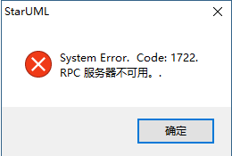
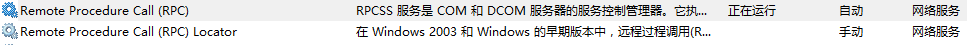
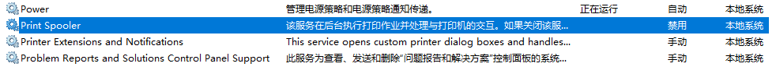

<!--more-->
## 问题

最近在软件设计上机课的时候，使用 starUML 建模工具画UML图的时候总是弹出一条如下信息

虽然是错误，但是点击确定后软件能正常使用，可是这样还是不太好。一般来说出现这种错误应该是某个windows 服务没有打开而导致的问题。

## 解决办法

经过上网查资料，发现只要打开RPCSS服务就可以了，可是我却发现我这里RPCSS服务是正在运行，既是重启也不管用。

没有办法，继续查资料，最后发现原来是 Print Spooler 这个服务没有启动,只要启动这个服务就可以了。于是我在服务里看，原来这个服务真的是关闭状态，而且还是禁用。

将这个服务改启动为自动，并且启动后发现再次打开 starUML 的时候没有报错

## 后文

但是我这里为什么 Print Spooler 服务是禁用的呢，经过回想，发现之前我嫌win 10 有太多无用的服务，于是就关闭了不少，其中就包括这里的 Print Spooler 服务（与打印有关的服务）。

